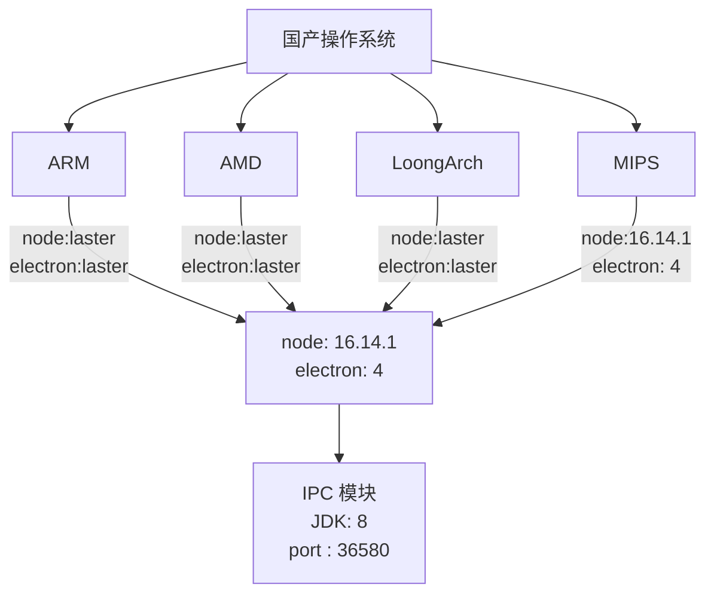
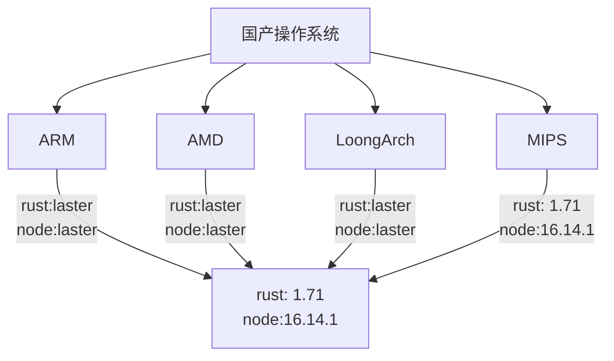

# 编译 tauri 的疑难杂症 {.font-600! v-click}

在国产操作系统中使用 tauri 的疑难杂症

  
Work Talks

  

    November 22th, 2024
  

<!--
[click] 之前的几周我们将 tauri 在国产操作系统中遇到的大部分疑难杂症解决了。

[click] 这是一个收尾的向上汇报

[click] 在上一个架构中我们其实有非常多的问题，Electron + Java 其实有着居多的问题

[click] 我们先来讲述一下**前情提要**，在那个时间非常稀少的时候，需要拿出一套交付方案，所以我们需要考虑一下当时最简单最直接的解决方案。

我们需要一套代码，支持 `多端编译`、`多架构行为一致`。这是非常有挑战性的，那么在当时 Electron 是界面渲染层的唯一解决方案。

而要达成这些条件，我们首先需要找到最小原则。

众所周知，在 AMD 和 ARM 的架构下，我们有着最完善的社区支持，所以我们不必过度担心这两种架构之下的编译问题。

而 LoongArch 架构之下，龙芯公司也给我们提供了比较好的开源软件生态。所以我们在遇到生态问题中，龙芯其实也可以快速的提供支持。

但是 MIPS 架构之下，由于 MIPS 架构之前多用于 `嵌入式` 和 `命令行` 的系统，所以在基于上游的桌面化系统是天然支持度不够。

同时社区其实并没有给 MIPS 架构足够的尊重，所以他只能支持 `Node 14.16.1`，在这种情况之下，所能够选择的 Electron 版本自然不可能顺应潮流。

*所以在后面我们不会过多阐述在 ARM 和 AMD 架构之下会产生的问题。*
-->

---
layout: fact
---

# Electron {.font-600!}

<!--
我们会在后面详细描述一下 Electron 架构的一些问题和一些之前的想法
-->
---
layout: fact
---

<v-clicks>

</v-clicks>

<!--
通过最小原则，我们现在已经可以得到一个应用，但是由于我们只能采用 electron 4。

[click]

缺点

1. 导致了我们在开发过程中就没有办法进行调试和预览，一切的代码开发都是在黑盒中操作。

2. 同时由于文档的缺失，导致我们无法查阅当时的API进行一些功能的编写。

3. 同时由于版本和源码的丢失，导致我们其实没有办法实现 source map 的功能，这对于排查和开发都是非常棘手的问题。

所以我们设想出可以使用 Java 来代替这部分的功能，取代 Electron 中 IPC 的部分。但是这也导致增加了内存的消耗和性能的缺失。

4. 内存的增加因为我们的应用中增加了 java 模块的内存消耗

5. 而性能的缺失是因为原先采用了 进程之间的通信，但是改成了http之间的通信就会产生性能的丢失。
-->

---
layout: fact
---

# Tauri {.font-600!}

<!--
我们简单的介绍了旧架构的一些问题，其实有些老生常谈，那么我们就先来聊一聊 rust 的优势

rust 的优势

Rust 是一个 类C 的语言，这类语言有一个非常棒的优点，编译之后的性能十分出色，
且内存消耗小，安装包较小，但是开发效率会较低。同时因为 Rust 是一个小众语言，社区支持
层面可能并不如 Node.js 和 Java。

同时我们已经实现了 tauri 在各个国产操作系统之间无法运行的问题。

接下来，我们先来描述一下在 LoongArch 架构下所遇到的问题。
-->

---
layout: fact
---

<v-clicks>

</v-clicks>

<!--
[click] 这是我们在 rust 方案中大体的路线，我们也会跟着这个路线来一步一步的描述所遇到的问题，我们首先来解决简单的 LoongArch 架构的问题
-->

---

<ul>

<li v-click>

Q: 前端依赖并没有完全支持 LoongArch

  A：因为 Rollup 和 tauri 并不支持 loongArch 架构，
所以需要阅读源码和修改源码，才能在这种架构之下
运行和编译产物。

</li>

<li v-click="3" class="mt-16">

Q：loongArch 架构并不是 rustup 的一等公民

  A：所以需要自己维护一套专属架构的 rustup

</li>

</ul>

<!--
[click] 第一个问题就是 其实 rollup 和 @tauri/cli 对于的一些特殊的架构并没有支持，所以会产生很多的错误，

[click] 我们需要在安装依赖的时候需要修改 node_modules 中的源码，让代码拥有 AWSM 的能力。

[click] 官方的 rustup 其实没有对于 LoongArch 架构的 rust 有支持所以导致我们无法使用官方的 rustup 脚本进行安装

[click] 我们需要维护一套对于 LoongArch 架构下的专属的 rustup 脚本

这就是 LoongArch 架构下的一些问题，我们接下来复盘一下 MIPS 的问题
-->

---

<ul>

<li v-click>

Q: MIPS 并没有 高版本 的 Node.js 支持

  A：所以需要自己手动安装编译较高版本的 Node.js

</li>

<li v-click="3" class="mt-16">

Q：MIPS 并没有 Rust 的支持

  A：使用社区的Cross进行安装

</li>

</ul>

<!--

MIPS 说的直白一点就是 **一无所有**

[click] 第一个问题就是 因为 Node 并没有给予 MIPS 架构的支持

[click] 我们需要自己手动安装编译较高版本的 Node.js

[click] MIPS 并没有 Rust 的支持

[click] 使用社区的Cross进行安装

这就是 MIPS 架构下的一些问题，我们接下来看一下非常棘手的问题
-->

---

<ul>

<li v-click>

Q： 如果在mips架构之下无法进行前端模块的编译该怎么实现最终的编译呢？

  A： 编写一个插件，让 IPC 通信可以忽略架构的
问题，无视架构，只需要关注 rust 层即可

</li>

<li v-click="3" class="mt-16">

Q：特殊架构并不能编译出deb

  A：所以需要自己编写生成deb的脚本

</li>

</ul>

<!--
[click]
[click] 因为我们需要支持 MIPS 的我们应该如何解决，所以我们需要实现 IPC 通信可以无视架构的问题。

[click]
[click] 由于 tauri 的 build 模块并没有研究的特别透彻，所以我们需要自己编译 特殊架构 之下的 build 脚本
-->
